# Corchim /w corne cherry v3

## 手順

### 1. 同梱物の確認

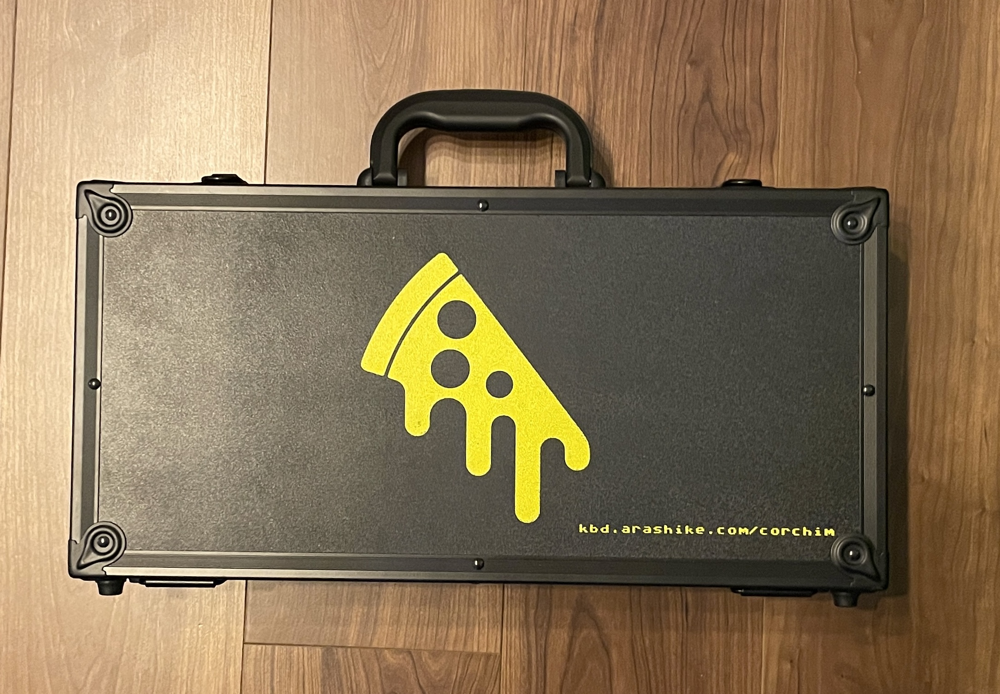

| 名称                                                    | 個数                 |
| ------------------------------------------------------- | -------------------- |
| ケース左右一式                                          | 1 対                 |
| ケースフォーム (ケースと PCB の間に挟むもの)            | 2 対                 |
| スイッチフォーム (PCB とスイッチプレートの間に挟むもの) | 1 対                 |
| スイッチプレート (ポリカーボネート)                     | 1 対                 |
| ガスケット (粘着付き)                                   | 1 対                 |
| MCU 用高さ調整フォーム                                  | 1 対                 |
| OLED 高さ 5.7mm ピンソケット                            | 2 個                 |
| OLED 高さ 1.5mm ピンヘッダ                              | 2 個                 |
| ケース上下締結用ネジ: 六角 M2 x 8mm                     | 8 本 (左右 4 本ずつ) |
| ウェイト締結用ネジ: ヘクサロビュラ M3 x 4mm             | 4 本 (左右 2 本ずつ) |

ケース左右には以下が含まれます

- left
  - トップ側ボディ
  - ボトム側ボディ
  - ウェイト
  - スイッチプレート
- right
  - トップ側ボディ
  - ボトム側ボディ
  - ウェイト
  - スイッチプレート

### 2. ケースを取り出し、ネジをはずす

工場製造時に仮止めしてあるネジがついているのでそちらのネジを外します。

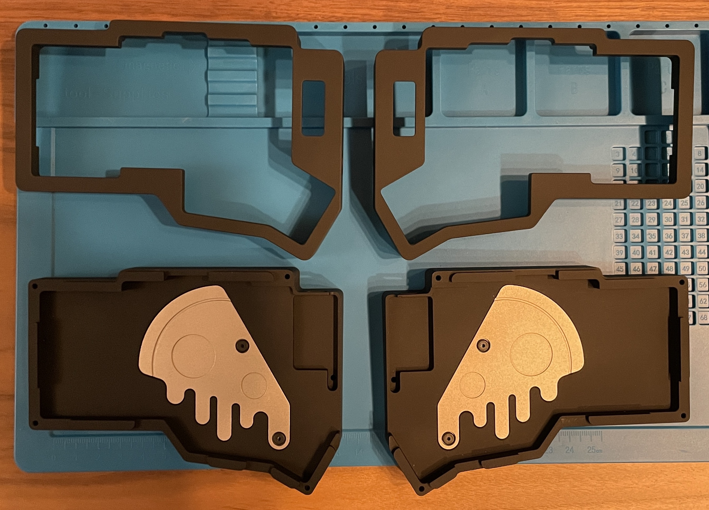

ここでウェイトのネジも仮止め用のネジから付属の黒いネジ M3 x 4mm ネジと交換します。

### 3. ケースフォームの設置

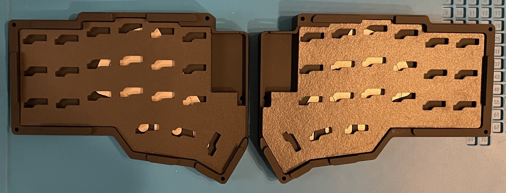

#### 3-a. (optional) MCU フォームの設置

通常必要ないはずですが、USB の抜き差しによって MCU が外れやすい場合は、こちらのフォームを敷いてください。
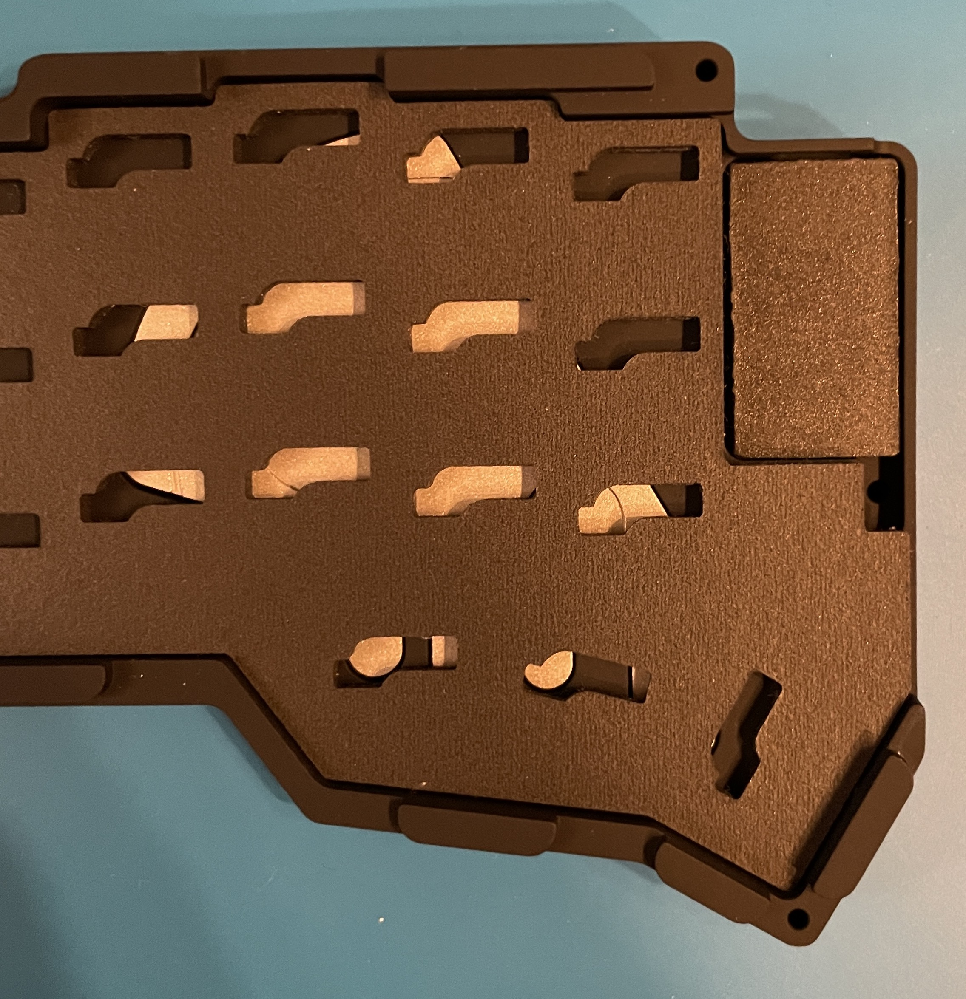

#### 3-b. (optional) LED を実装した PCB を設置する際

アンダーグロー LED を実装済みの PCB を使用する際は、ケースフォームを 1 枚分の厚みだけで利用することを推奨します。
(2 枚の厚みでも問題なく動作しますが、ちょっと中身つまり過ぎな気がします)

### 4. PCB の設置

ケースフォームの上に PCB を設置します。このときケースフォームのソケットの位置に PCB が合うように設置します。

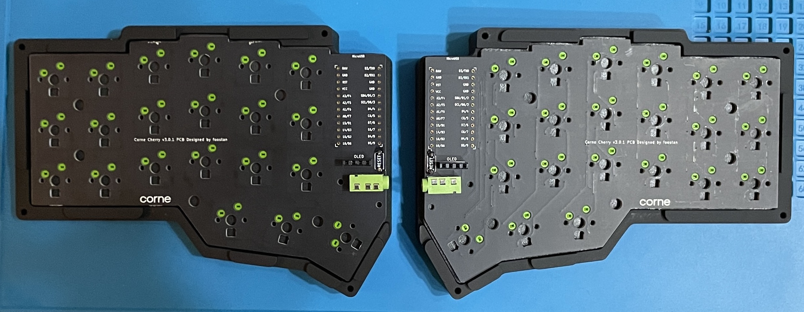

### 5. ガスケットと OLED を支えるフォーム

スイッチプレートにガスケットを貼ります。

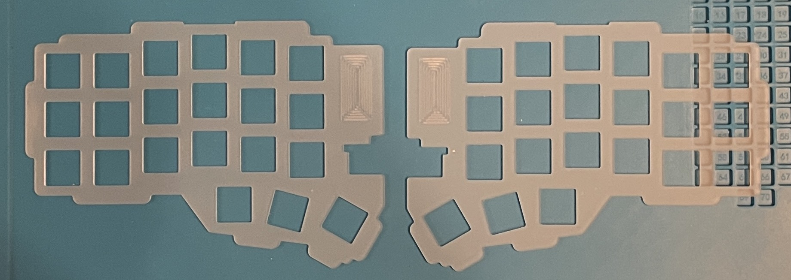

このとき、OLED 用のくぼみに合うように OLED 用フォームも貼ります。

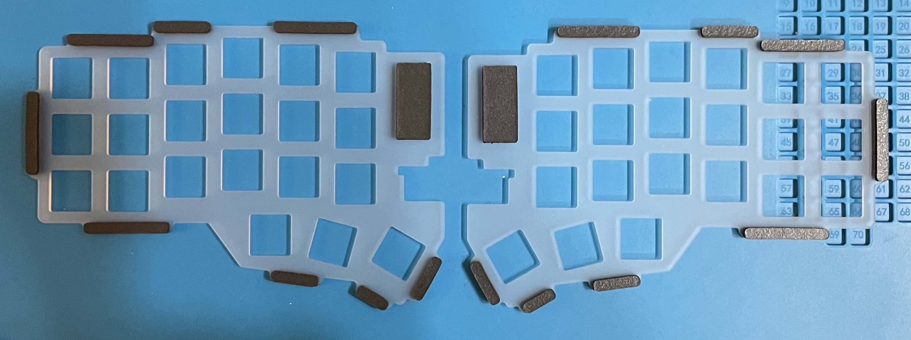

ガスケットには長さが 3 種類あるのでサイズが合うように表面/裏面の両方に貼ります。

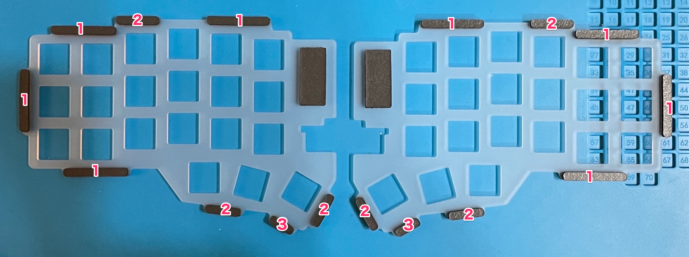

### 6. スイッチプレートとスイッチフォームの設定

写真のようにスイッチフォームを PCB の上に敷きます。

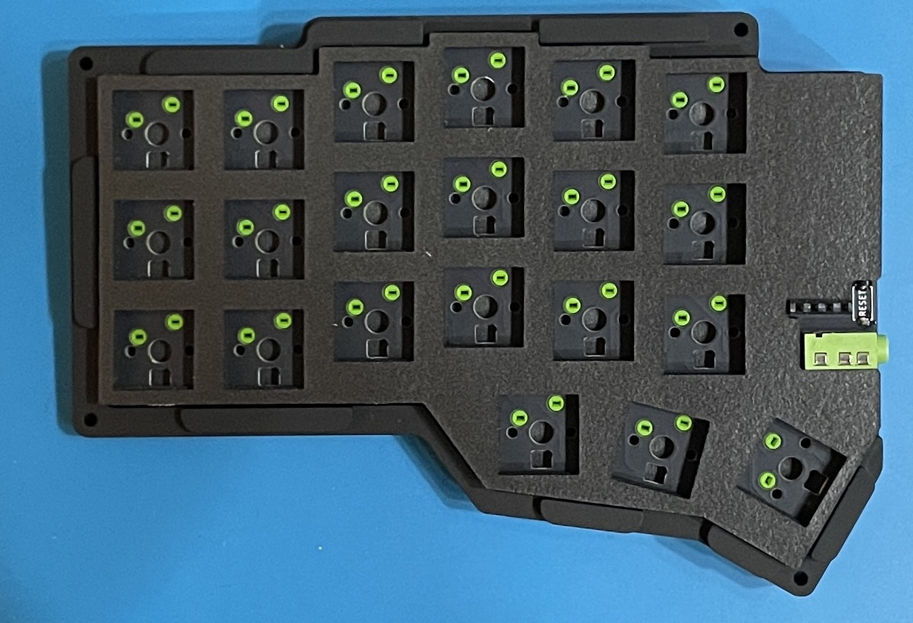

さらにその上にスイッチプレートを敷きます。ケースを被せるときにスイッチプレートとスイッチフォームがずれるのを防ぐために適当なキースイッチで四隅を固定します。

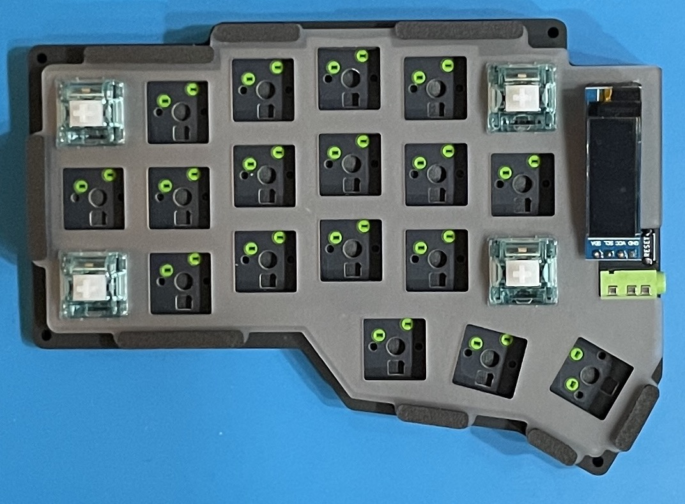

### 7. トップボディをかぶせてネジで締結

トップボディをかぶせて、底側から M2 x 8mm のネジ 4 本で締結します。

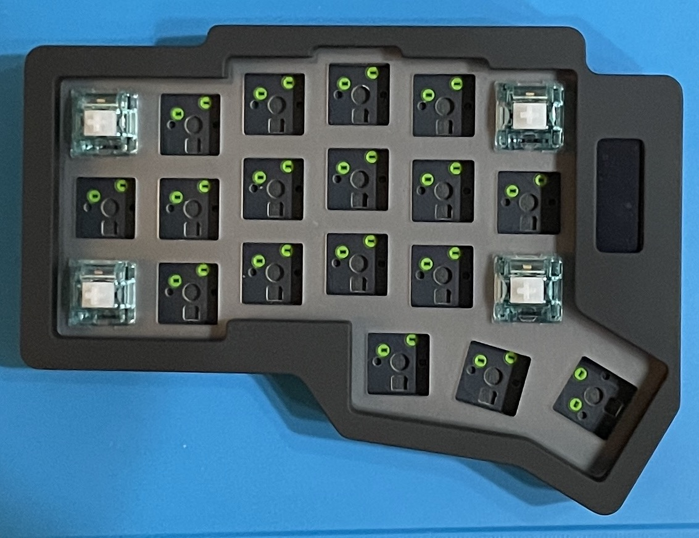

### 8. ゴム足

ケース底面の穴にゴム足を取り付けます。

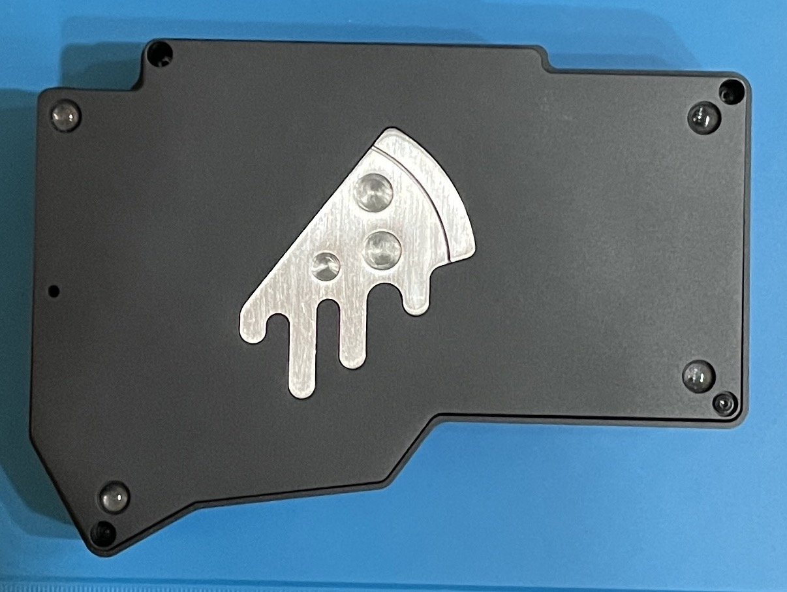

### 9. キーキャップ

キーキャップを取り付けて完成!! Congrats!! Corchim をお楽しみください!!

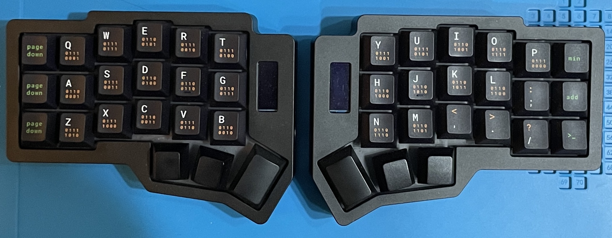
