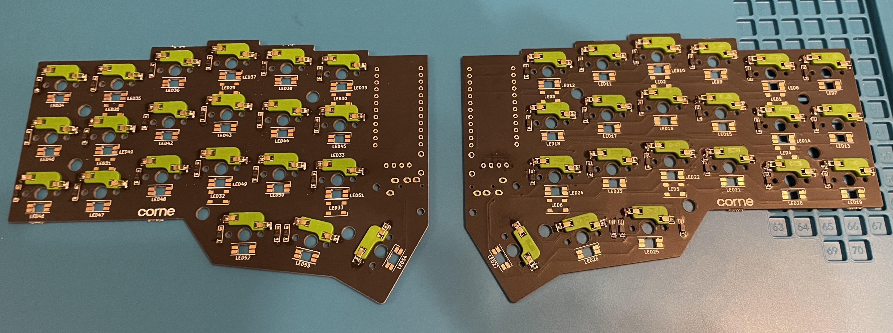
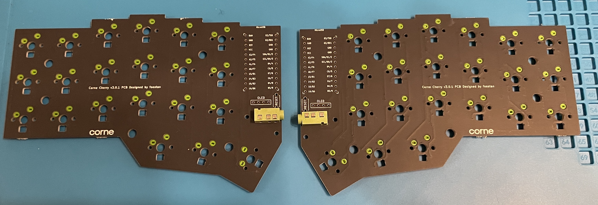
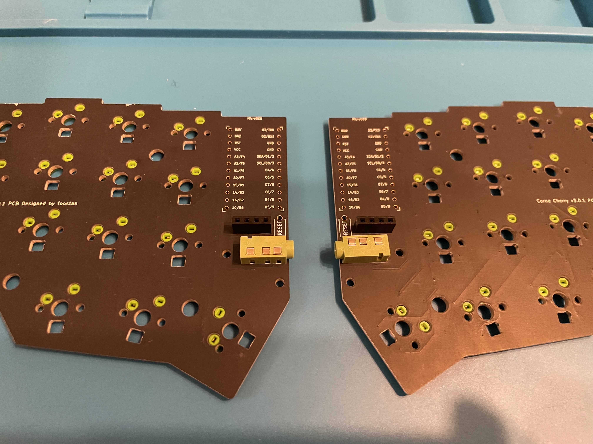
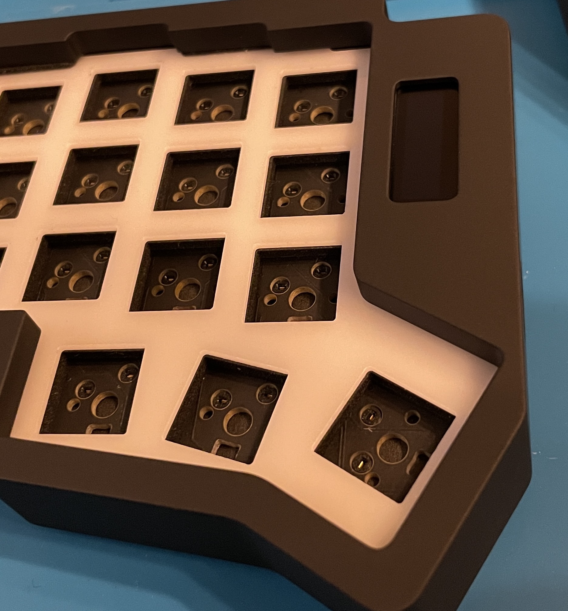
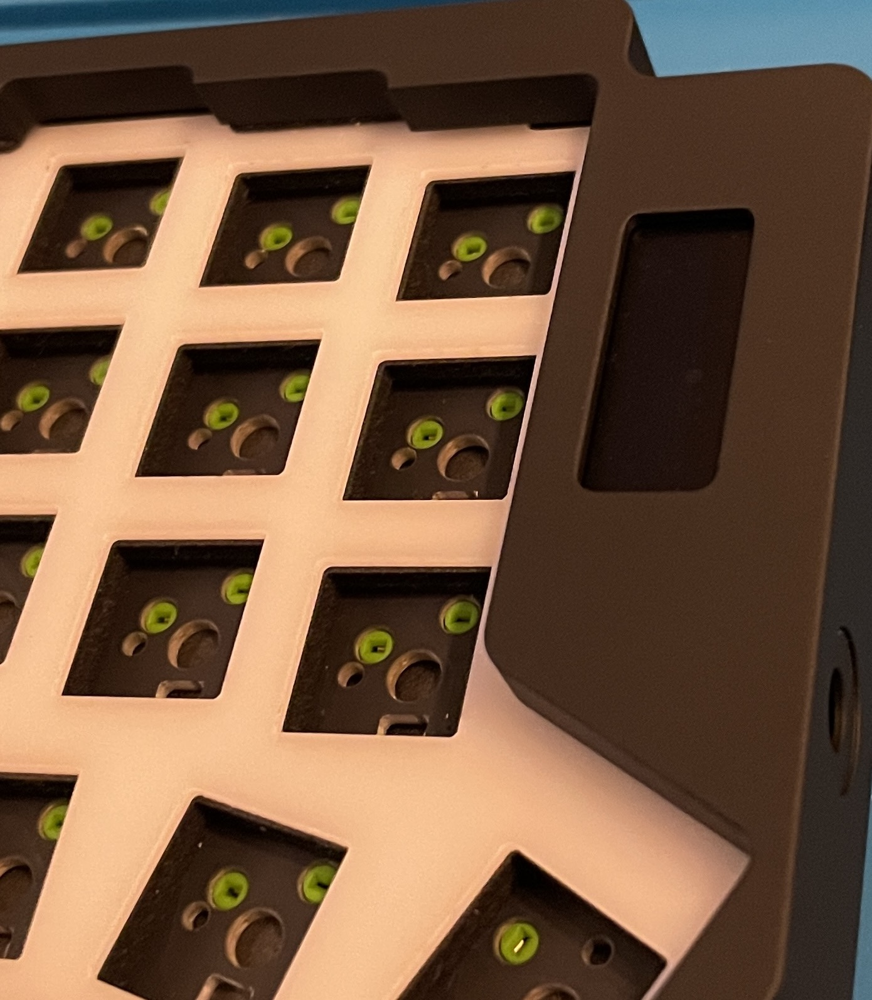
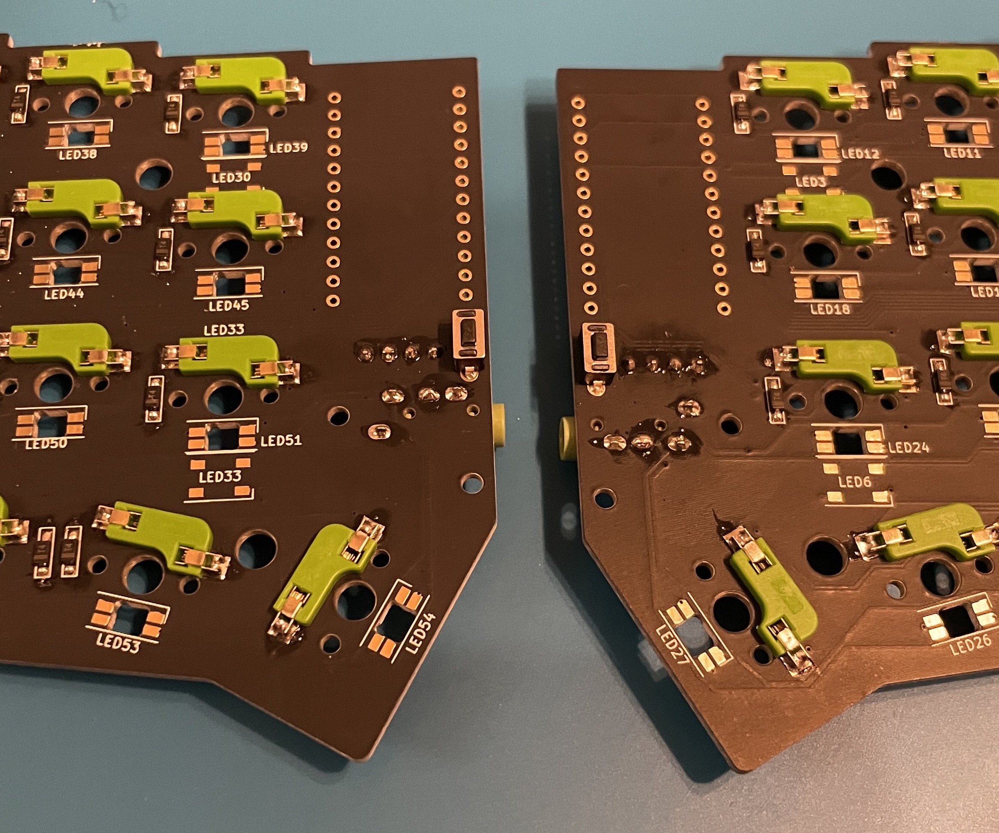
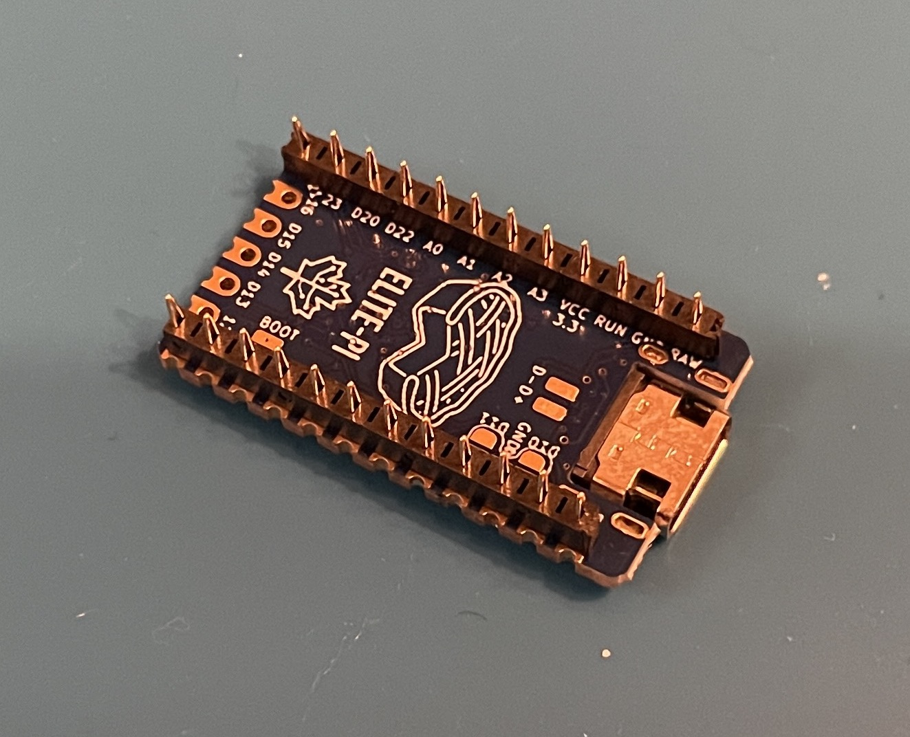
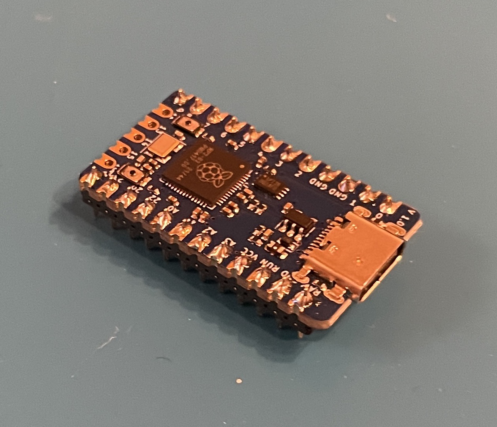

# PCB 準備 for Corne cherry v3

## PCB 組み立てに必要なもの

| 名称                                                | 個数              |
| --------------------------------------------------- | ----------------- |
| Corne cherry v3 PCB                                 | 1 セット (左右分) |
| 表面実装ダイオード ( 1N4148W )                      | 42 個             |
| MX 用 PCB ソケット                                  | 42 個             |
| TRRS ジャック ( PJ-320A )                           | 2 個              |
| OLED 128x32                                         | 2 個              |
| 対応してる MCU                                      | 2 個              |
| MCU 用コンスルーピンまたはピンソケット (高さ 2.5mm) | 4 個              |
| リセットスイッチ用タクトスイッチ (2 ピン )          | 2 個              |

---

以下は必要ですが, Corchim に同梱されています

| 名称                | 個数 |
| ------------------- | ---- |
| OLED 用ピンソケット | 2 個 |
| OLED 用ピンヘッダ   | 2 個 |

### 余談 kailh MX 用ソケットの色について

某所で質問されたので答えておくと、色はなんでも問題ありません。ファッションです ( ケースつけると見えないので特に意味はないかもですけど )。購入先としては

- https://shop.dailycraft.jp/products/keyswitch_socket_transparent
- https://chosfox.com/products/kailh-colorful-hot-swap-socket
- https://ja.aliexpress.com/item/1005003174680450.html

このあたりです。

### compatible MCU

- Elite-C
- Elite-Pi
- key micro

(各種ファームウェアの焼き方は現在 WIP なので近日中にビルドガイドを更新します)

### MCU 用のピンソケット (コンスルーピン) について

USB-C の差込口の関係で, 高さ 2.5mm を推奨としいます。

## 手順

### 1. ダイオードとソケットのはんだ付け

[ダイオード](https://github.com/foostan/crkbd/blob/main/corne-cherry/doc/v3/buildguide_jp.md#%E3%83%80%E3%82%A4%E3%82%AA%E3%83%BC%E3%83%89)と[ソケット](https://github.com/foostan/crkbd/blob/main/corne-cherry/doc/v3/buildguide_jp.md#pcb%E3%82%BD%E3%82%B1%E3%83%83%E3%83%88)のはんだ付けは[オリジナルの Corne](https://github.com/foostan/crkbd/blob/main/corne-cherry/doc/v3/buildguide_jp.md)と手同じ手順です。
LED は not supported です。っが、ついていても特に問題ありません (後述します) 。

### 2. TRRS のはんだ付け

TRRS も同様にオリジナルの Corne と同じ手順です。

### 3. OLED ピンソケットのはんだ付け

5.7mm のピンソケットと 1.5mm のピンヘッダを同梱しています。
ですが、オリジナル同梱されている 3.5mm のピンソケットであっても特に問題ないので、どちらを使っていただいても問題ありません。以下は比較画像 (ケースをかぶせるとどちらも大きく違いはありません)

3.5mm ピンソケットに 2.5mm ピンヘッダ

5.7mm ピンソケットに 1.5mm ピンヘッダ

OLED 側のピンヘッダははんだ付け後、ピンの先をニッパー等でカットしてください。

### 4. リセットスイッチ (optional)

オリジナル Corne とは反対向きに (基盤の底側に) リセットスイッチをつけることで Corchim 底側からリセットスイッチを押せるようになります。( ただこちらはなんとでもなると思うので、optional 扱いです )

### 5. MCU 取り付け

MCU の取り付け方向がオリジナルの Corne とは違うので注意です。基盤の底面から MCU が生えてくる形になるので、画像のような取付方向となります。(もし取付方向に不安が残る場合は [discord](https://discord.gg/tuykB7h5d9) に写真を貼っていただければ確認します)

ここまでで一旦 PCB は完成です, お疲れ様です!! ケースに取り付けていきましょう!! [ケース編](./corchim-cherry-v3.md)

## ファームウェア

(WIP: QMK のコマンドと MCU の組み合わせを掲載する予定です)
